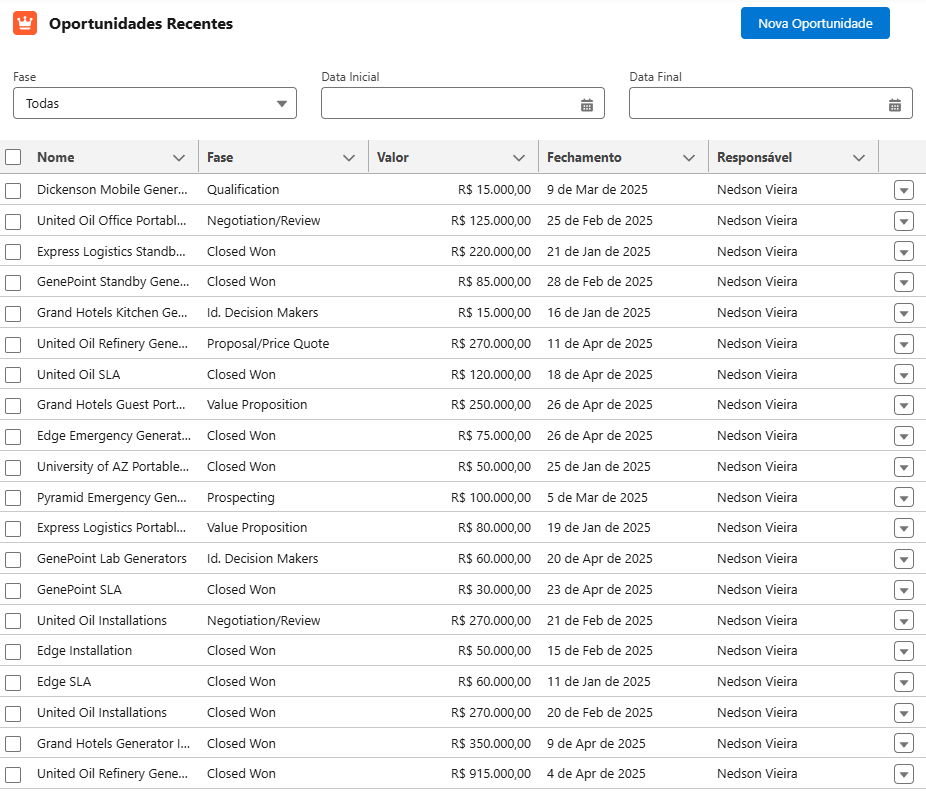
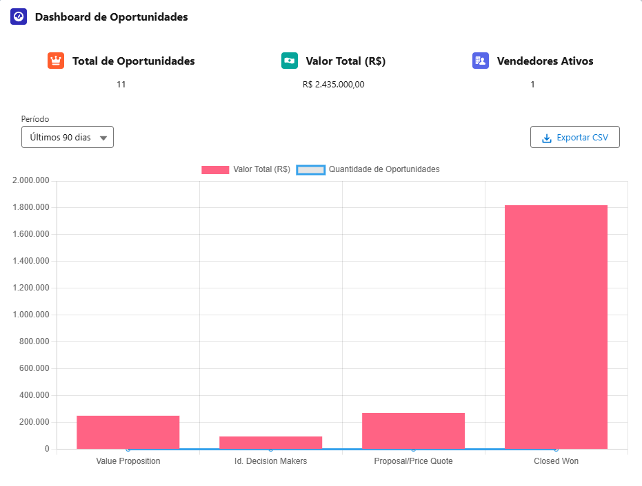

# Salesforce Oportunidades - App LWC + Apex

Este projeto é um aplicativo moderno para Salesforce desenvolvido com **Apex** e **Lightning Web Components (LWC)**, com foco na **visualização interativa e gerenciamento de oportunidades de vendas**.

## ✨ Funcionalidades

- 📋 **Tabela Interativa de Oportunidades**  
    Componente para listagem de oportunidades com visual limpo, ordenação e navegação.
 

    
- 📊 **Dashboard com Indicadores de Vendas**  
    Exibe métricas (KPIs), gráficos dinâmicos, filtro reativo por tempo (30/60/90 dias) e permite exportação dos dados.



[]

## 🧩 Componentes do Projeto

### 🔹 `opportunityList` (LWC)

Responsável por exibir uma **tabela com oportunidades** extraídas do Salesforce.  
Funcionalidades:

- Exibição de campos principais como nome, valor, estágio e data de fechamento.
    
- Uso do `NavigationMixin` para permitir que o usuário navegue diretamente para o registro da oportunidade.
    
- Utilização do `ShowToastEvent` para exibir mensagens de sucesso ou erro.
    

### 🔹 `salesDashboard` (LWC)

Componente gráfico que exibe:

- **KPIs agregados**, como total de oportunidades, valor total e número de oportunidades abertas.
    
- **Gráfico dinâmico** usando `Chart.js`, para visualização por estágio ou por período.
    
- Botão de **exportação**, permitindo ao usuário baixar os dados exibidos.
    

### 🔹 `OpportunityService` (Apex)

Classe que executa as consultas de oportunidades no Salesforce.  
É responsável por fornecer os dados consumidos pelos componentes LWC, com filtros e segurança aplicados no servidor.

### 🔹 `KpiSummary` (Apex)

Classe utilitária que calcula os KPIs com base nas oportunidades disponíveis.  
Fornece estatísticas rápidas como:

- Número de oportunidades abertas
    
- Soma de valores de oportunidades
    
- Número total de registros
    

### 🔹 `OpportunityServiceTest` (Apex Test Class)

Classe de testes que valida o comportamento de `OpportunityService`, garantindo confiabilidade no código.

## 🛠️ Tecnologias Utilizadas

- **Apex** (serviços e lógica de backend)
    
- **LWC** (componentização frontend)
    
- `Chart.js` (gráficos)
    
- `NavigationMixin` (navegação entre registros)
    
- `ShowToastEvent` (notificações de usuário)
    
## 📁 Estrutura do Projeto

```markdown
projeto/
├── classes/
│   ├── OpportunityService.cls
│   ├── KpiSummary.cls
│   └── OpportunityServiceTest.cls
│
└── lwc/
    ├── opportunityList/
    └── salesDashboard/
```
